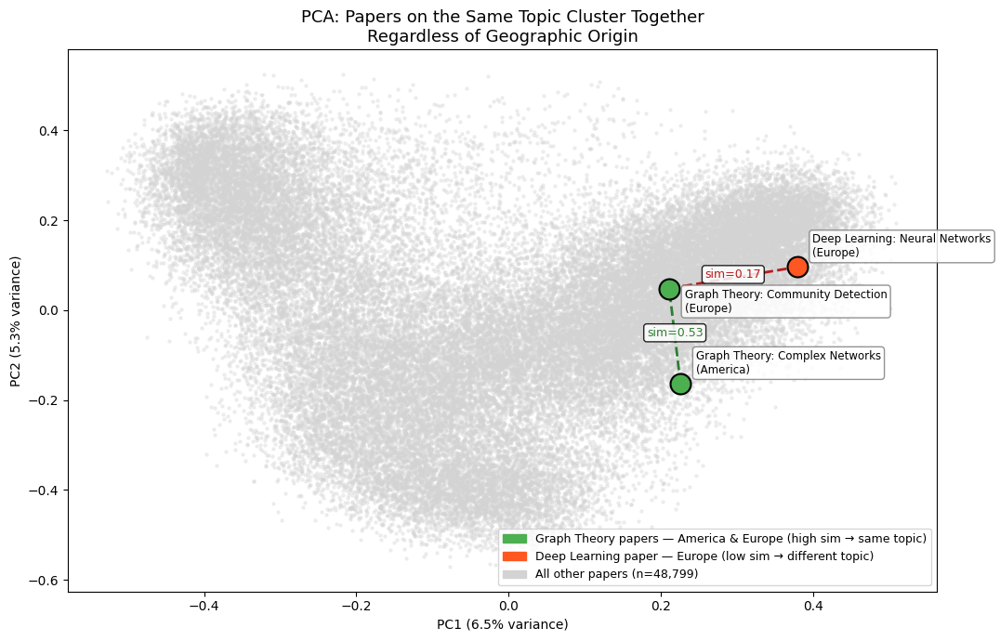
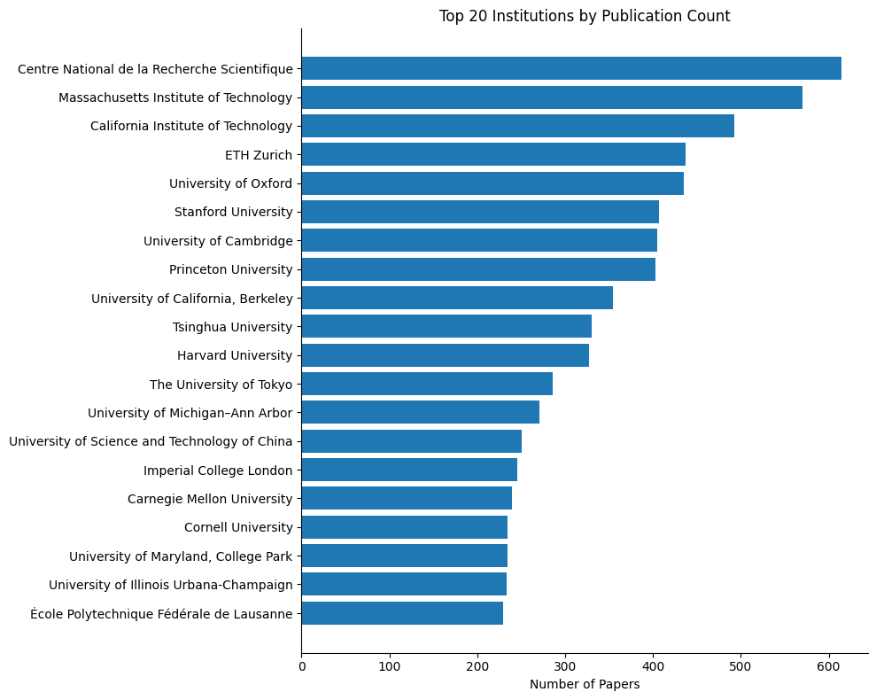
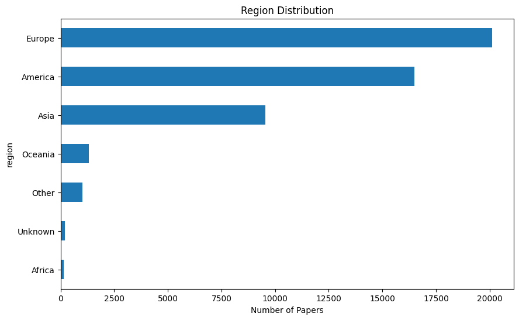

# RAG System for arXiv CS Papers

## Project Overview
This project implements a **Retrieval-Augmented Generation (RAG)** system over a subset (~50k) of Computer Science papers from arXiv.  
The system retrieves relevant papers given a query and analyzes **institutional and regional representation** in retrieval results.

---

## Features
- Embedding generation using **Sentence Transformers** for title + abstract.
- Vector similarity search with **ChromaDB**.
- Metadata-based analysis of papers by:
  - Institution
  - Region
  - Tier (Privileged vs Underrepresented)
- Baseline retrieval evaluation using **NDCG@10** and **MRR**.
- Interactive dashboard with **Streamlit** for visualizing fairness and institutional distribution.

---

## Data Pipeline

### 1. Data Collection & Preprocessing
- Extracted metadata fields:  
  `id`, `title`, `abstract`, `primary_institution`, `region`, `categories`.
- Combined `title + abstract` to generate embeddings.
- Metadata stored alongside embeddings for retrieval context.

### 2. Embedding Generation
- Used **Sentence Transformers** (`all-MiniLM-L6-v2`) to generate vector embeddings.
- Stored embeddings in **ChromaDB** with:
  - `documents` (title + abstract)
  - `embeddings` (vector representations)
  - `metadatas` (institution, region)
  - `ids` (unique document IDs)

### 3. Query & Retrieval
- Test queries generated from random or representative subsets.
- Queries embedded with the same model as papers.
- ChromaDB similarity search retrieves top-K relevant papers for each query.

---
## Embedding Visualization

To understand the distribution of paper embeddings, a **2D PCA projection** was generated for the 50k subset of CS papers. This helps visualize clustering by institution, region, or other metadata.

### PCA Projection Example



- Each point represents a paper in the dataset.
- Color coding can reflect:
  - **Region** (e.g., America, Europe, Asia, Oceania)
  - **Institutional tier** (Privileged vs Underrepresented)
- Dense clusters indicate semantically similar papers in the embedding space.

> Note: PCA reduces high-dimensional embeddings (e.g., 384 dimensions from MiniLM) to 2 dimensions for visualization only. Retrieval and similarity searches use the full embedding vectors.

## System Architecture
arxiv_rag_project/
├── data/
│   ├── raw/                 # Original arXiv metadata files
│   ├── embeddings.npy        # Precomputed embeddings
│   ├── embeddings.json       # Metadata + IDs for papers
│   └── chroma_db/            # Persistent ChromaDB collection
├── notebooks/
│   └── query_test.ipynb      # Query and retrieval testing
├── src/
│   ├── autoencoder.py        # Optional: if using autoencoder for embeddings
│   ├── embedding_pipeline.py # Embedding generation code
│   └── rag_app.py            # Streamlit dashboard for analysis
└── README.md


## Evaluation

### Metrics
- **NDCG@10**: Measures ranking quality of retrieved documents.
- **MRR**: Mean Reciprocal Rank for top-1 retrieval relevance.

### Example Institutional Distribution Charts

#### Top Institutions in Retrievals


#### Tier Distribution (Privileged vs Underrepresented)


#### Regional Distribution of Results


---

## Institutional Tier Definition
- Institutions grouped per region into **Privileged (Top-tier universities)** and **Underrepresented**.
- Example (hardcoded for analysis):
  - **North America**: MIT, Stanford, UC Berkeley → Privileged
  - **Europe**: ETH Zurich, University of Oxford → Privileged
  - Other universities → Underrepresented
- This classification enables **bias and fairness analysis** in retrievals.

---

## Technical Stack
- **Languages**: Python, Java, C++  
- **ML & NLP**: PyTorch, Sentence Transformers, BERT  
- **Vector DB**: ChromaDB  
- **Backend / DevOps**: FastAPI, Streamlit, Docker  
- **Cloud**: AWS (EC2, S3, RDS, ElastiCache)  
- **Data Analysis & Visualization**: Pandas, Matplotlib, Seaborn  

---

## Next Steps
1. Complete institutional tier mapping for all regions.
2. Compute **baseline NDCG@10 and MRR** for 20–30 test queries.
3. Visualize and analyze:
   - Tier-wise retrieval distribution
   - Region-wise retrieval distribution
4. Integrate with **LLM pipeline** for query-driven summarization.

---

## Usage

```bash
# Install dependencies
pip install chromadb sentence-transformers torch fastapi streamlit pandas matplotlib seaborn

# Run embedding pipeline
python src/embedding_pipeline.py

# Launch Streamlit dashboard
streamlit run src/rag_app.py
